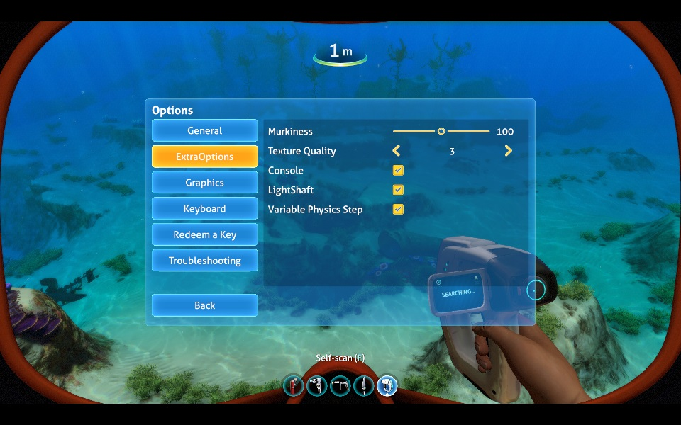

Compiled against subnautica release, may work on experimental.

Exposes the following debug menu options (and makes them persist between gameplay sessions)
- Console (~ to activate)
- LightShaft
- Variable Physics Step
- Texture Quality (0 being worst, 4 being best)

Additionally adds the following custom options
- Murkiness: 0 = clearer water, 200 = murkier water.
- Fox "Fix": When in a vehicle, base objects outside do not have fog applied. This hack makes the shaders think you are always outside of a vehicle.